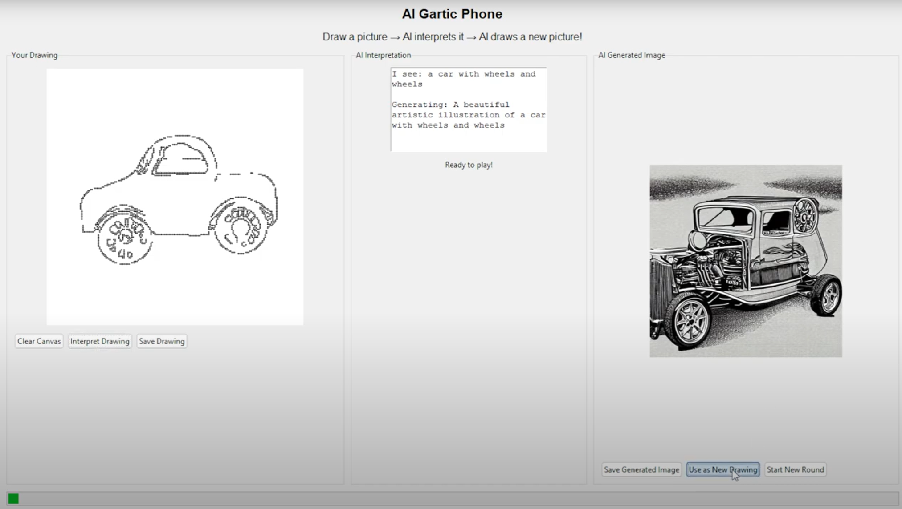

# AI Gartic Phone

An interactive game where users draw pictures, AI interprets them using image captioning, and then generates new artistic images based on that interpretation.

Inspired by the game "Gartic Phone"

### Click the video to see it in action!
[](https://youtu.be/dBs735IEo00)

## Models Used

- **Image Captioning**: Salesforce/blip-image-captioning-base
- **Image Generation**: runwayml/stable-diffusion-v1-5

## Setup

Install the required packages:

```
pip install -r requirements.txt
```

## Usage


```
python ai_gartic_phone.py
```

## Customization

You can modify the generation prompts in the code to change the style, for example
- "in the style of Van Gogh"
- "watercolor painting" or "pencil sketch"