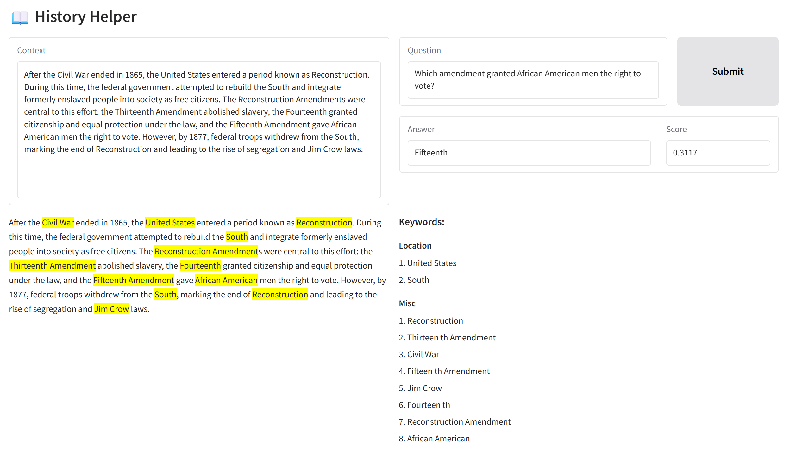

# History Helper
_History is long. Our time is limited. **History Helper is here to help.**_

## Key Features

### Question Answering
Simply input your context and question. History Helper will find the answer from the context, and output a score of how confident it is. 

Never waste time finding the answer in a bunch of dense text again!

### Keyword Identification
We know history has many keywords, which are important and will be tested on the exam. History Helper will scour the text and identify all possible keywords (people, locations, organizations, misc) and even highlight them in the text for you, so it is easier to read the text and revise.

With the handy list of keywords, see everything that could be on the exam at just one glance!

## How to Run
1. `pip install -r requirements.txt`
2. In directory `submissions/kai_wen_khoo`, run `python src/main.py`
3. Go to `http://127.0.0.1:8080` in your browser
4. Enjoy!

## Sample Case
Sample Context: `After the Civil War ended in 1865, the United States entered a period known as Reconstruction. During this time, the federal government attempted to rebuild the South and integrate formerly enslaved people into society as free citizens. The Reconstruction Amendments were central to this effort: the Thirteenth Amendment abolished slavery, the Fourteenth granted citizenship and equal protection under the law, and the Fifteenth Amendment gave African American men the right to vote. However, by 1877, federal troops withdrew from the South, marking the end of Reconstruction and leading to the rise of segregation and Jim Crow laws.`

Sample Question: `Which amendment granted African American men the right to vote?`

Sample Answer: `The Fifteenth Amendment`