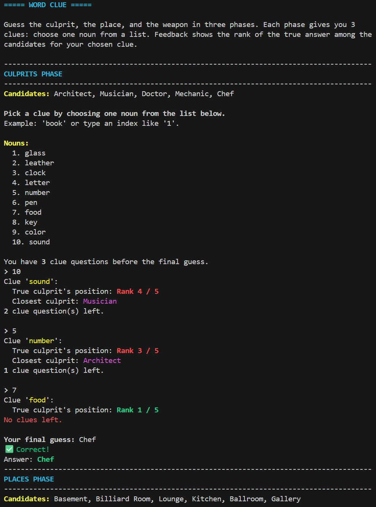

# 🧩 Word Clue

**Word Clue** is a lightweight, text-based mystery game inspired by the classic *Clue* board game.
Your goal is to sequentially uncover the **culprit**, the **crime scene**, and the **weapon** used inside a mysterious mansion.

You progress by choosing words as clues. Each word you provide is compared against hidden attributes of the true culprit, place, and weapon. The system gives you feedback about how close your clue is, guiding your deduction step by step. The game increases in difficulty as you advance: first 5 culprits, then 6 places, and finally 7 weapons.


## 📸 Example



## 💡 What it does

* At the start of each game, the system secretly selects a **culprit, place, and weapon**.
* In each phase (Culprit -> Place -> Weapon), you receive a list of candidate words.
* You choose one word per turn to test as a clue.
* The game computes semantic similarity between your chosen word and each candidate.
    * Technically, each candidate is treated as the centroid of its hidden attributes.
* Feedback is given in the form of **relative ranking** (e.g., "Rank 2 / 6") and the closest candidate.
* After **three** rounds of questioning, you must make your final guess.
* Your objective is to solve all three phases by making the correct guesses.

## 🚀 How to Run

### 1. Setup

First, ensure you have Python 3 installed. Then, set up your environment and install the necessary packages.

```bash
# Setup venv
python -m venv .venv
source .venv/bin/activate

# Install dependencies
pip install torch --index-url https://download.pytorch.org/whl/cpu
pip install numpy sentence-transformers
```
*Note: The first run will download the required AI model from Hugging Face.*

### 2. Launch the Game

Start the game by running `main.py`.

```bash
python main.py
```

Now, just follow the on-screen instructions to begin your investigation!

## 🤖 Model Used
- `sentence-transformers/all-MiniLM-L6-v2`: Embed words into vectors

## 🔮 Future Plans

- AI-generated clue words
- Player scoring system
- Improved similarity calculation
- Graphical User Interface (GUI)
